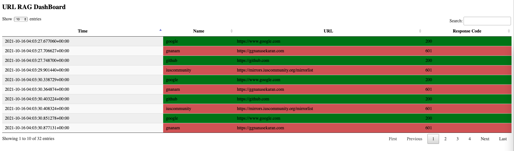

[](https://github.com/ggnanasekaran77/urlrag/actions?query=workflow%3Apytesting)
# URLRAG 
URL Red Amber Green status

## Requirements 
* docker 20.10+ (20.10.5)
* docker-compose 1.28+ (1.28.5)
* docker with 6CPU 8GB, refer this screenshot [docker settings](#docker-settings)

## INPUT
* CSV file
* Data Format, header should be similar
* Sample data 
```csv
name,url
google,https://www.google.com
gnanam,https://ggnanasekaran.com
```

## To RUN this App on MacOS
```shell
unzip urlrag.zip
# or
# git clone git@github.com:ggnanasekaran77/urlrag.git
cd urlrag
# URL_CSV_FILE=<<File Path>> docker-compose up
# Example below
URL_CSV_FILE=/tmp/urls.csv docker-compose up -d
# or
URL_CSV_FILE=./urls.csv docker-compose up -d
# To shutdown
docker-compose down
```

## To Open this app
* If local in browser open [http://localhost:8000](http://localhost:8000)
* If any server http://server_ip:8000

## Tech stack
* Python 3.9 
* FastApi
* InfluxDB - Time serious database
* Jinja2 Template
* GitHub Actions  
* Html

## Links
* [GitHub Actions CI](#gitHub-actions-ci)
* [10000 URLs with 4CPU Result](#1000-urls)
* [Results Screenshots](#results-screenshots)
* [Sample Demo Video](#demo-video)

## Improvements
* logger integration
* Python documentation
* Input validations
* Test Containers for pytest
* Deployment or CD

## GitHub Actions CI


## 10000 URLs


## Results Screenshots



## Docker Settings


## Demo Video
https://user-images.githubusercontent.com/8940344/137575131-5a499420-50b9-4996-8703-7bdbe1adb7ba.mp4


